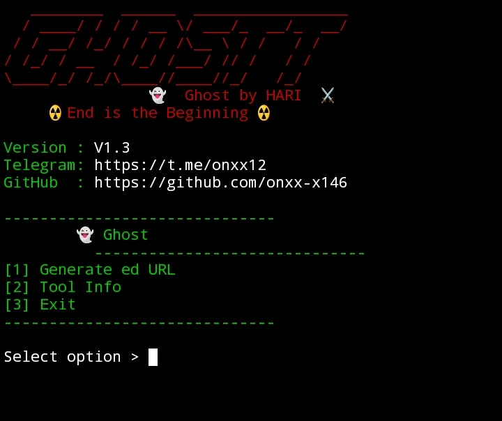

<h1 align="center">👻 Ghost</h1>

<b>Ghost by Digital ONXX</b> 
<i>⚔️ End is the Beginning</i>

---

🧠 About Ghost

👻 Ghost is a lightweight URL ing tool built for security demonstrations and phishing awareness.

🔗 It shows how attackers disguise links using custom domains, keywords and URL shorteners.

🛡 The goal is to help researchers and defenders understand and detect suspicious URLs during security demonstrations.

💻 Designed to run easily on Kali Linux and Termux with a simple CLI interface.

---

⚔️ Features

- ⚡ Fast URL ing
- 🔗 Multiple URL shorteners
- 🧩 Custom domain + keyword disguise
- 🕶 Hacker-style CLI interface
- 🚀 Parallel link generation
- 💻 Works on Kali Linux & Termux

---

🖥 Tool Preview

---

🧩 Requirements

- 🐍 Python 3.x
- 🔧 Git

---

📦 Installation

git clone https://github.com/onxx-x146/Ghost

cd Ghost

pip install -r requirements.txt

python ghost.py

---

🚀 Usage

Run the tool and follow CLI prompts.

Example:

Enter original URL: https://example.com/login
Enter custom domain: gmail.com
Enter keyword: secure-login

Ghost will generate multiple onxxed URLs.

---

💡 Example onxxed URL

https://gmail.com-secure-login@tinyurl.com/example

---

👤 Author

🧑‍💻 Digital Onxx AkA RiTik Jha

📢 Telegram
https://t.me/onxx12

🐙 GitHub
https://github.com/onxx-146

---

👀 Visitors

---

🖥 Terminal Status

⚔️ <b>End is the Beginning</b>

